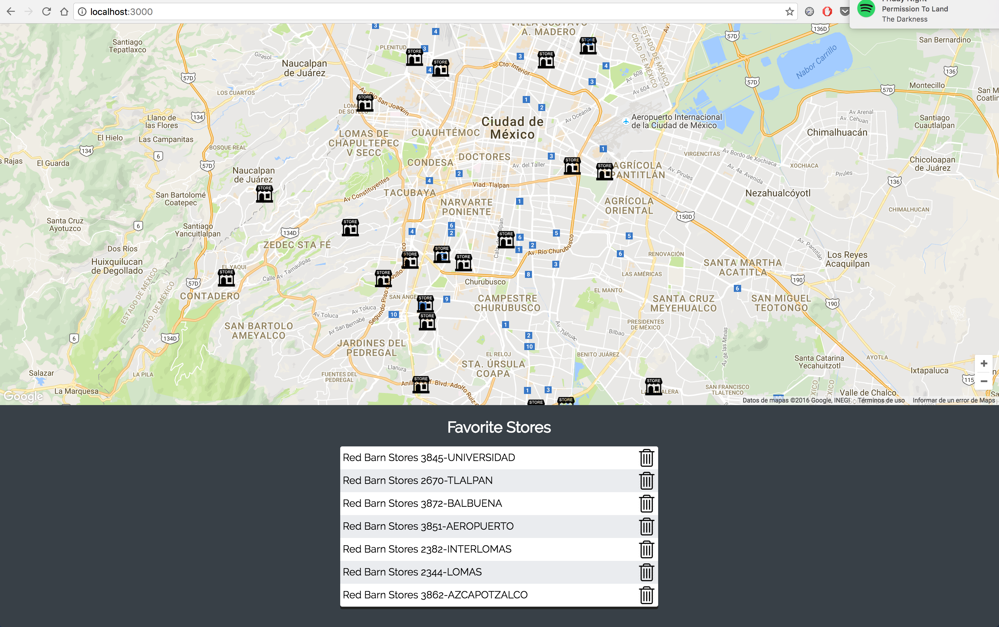

Generation Take-Home Coding Challenge
=================================
This is a take-home coding challenge used to help evaluate candidates
interested in joining the team at Generation.
The goal is for candidates to complete the coding challenge before the
in-person interview so that we can discuss the solution together.
In cases where this is not possible, we may discuss the solution together
over a followup phone call.


### Description
Google Maps application built with React JS, it displays several markers
from stores in Mexico City, stores data is read from a JSON file.

Location for the markers is retrieved using [Google Maps Geocoding API](https://developers.google.com/maps/documentation/geocoding/intro?csw=1)
and it's cached to prevent repeated calls.

Uses [google-map-react](https://github.com/istarkov/google-map-react) library
for displaying map and markers.

### Features
- Stateless and stateful React components
- ES6 code preferred
- CSS loader

### Run instructions

Clone the repo on your computer

Run
```
npm install
npm start
open http://localhost:3000
```

### Screenshot


